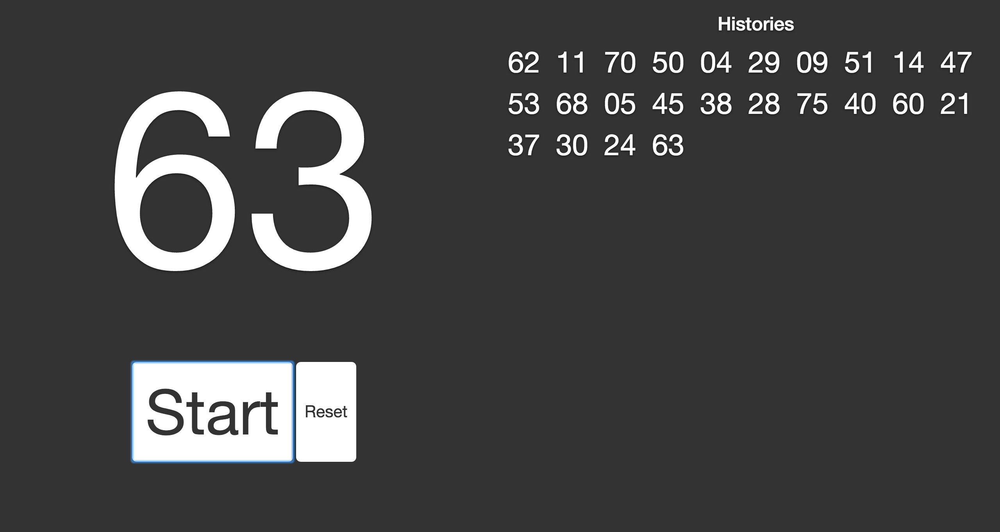

※フォーク元からレイアウトを変更しています。

結婚式の二次会などで利用できるJavaScriptのビンゴスクリプトです。  
サンプルは[こちら](http://ganezasan.github.io/partybingo/)で動かしてみることができます。

### 使い方
zipファイルを解凍後、index.htmlをブラウザで開くことで使うことができます。  
Startボタンを押すとルーレットがスタートし、Stopボタンを押すとルレットがストップします。  
ドラムロールは3.5秒ほど流れます。  
Startボタンはクリックの他、スペースキーを押しても動作します。  
なお、ルーレットの履歴はローカルストレージに保存しているため、
再読み込みをしても消えません。  
リセットボタンをクリックすることで履歴をクリアします。  

### ダウンロード
[こちらから](https://github.com/ganezasan/partybingo/archive/gh-pages.zip)

### 動作環境
動作確認は、

- Chrome
- Firefox

でしか行っていません。IEおよびEdgeでは動作しません。
なお、このプロジェクトをZipとしてダウンロードしてお使い頂ければ、
インターネット接続は不要です。

### ライセンス
MIT License
